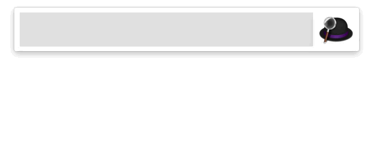

# Search on Salesforce

An [Alfred Workflow](https://www.alfredapp.com/workflows/) to search on your Salesforce account. It connects to Salesforce via the [Force.com REST API](https://developer.salesforce.com/docs/atlas.en-us.api_rest.meta/api_rest/intro_what_is_rest_api.htm). It runs entirely locally and does not share data with any third party.

## Download and Installation

Download the workflow file from [the latest GitHub release](https://github.com/jereze/alfred-salesforce/releases/latest) and install it by double-clicking on `Salesforce-0.0.4.alfredworkflow`.

You need to have Python 3 installed. If this is not the case, you can install [Xcode command line tools (click to read instructions)](https://macpaw.com/how-to/install-command-line-tools) provided by Apple.

## Usage

- Use `sf` to search for any contact, account, opportunity, lead on Salesforce
- Use `sf > login` to connect to your Salesforce account.
- Use `sf > logout` log out.
- Use `sf > switch` to switch the opening between Salesforce Classic and Salesforce Lightning.
- Use `sf > debug` to open some debugs logs.

## Changelog

**Version 0.0.5 (2022-08-22)**

- Migrate workflow from Python 2 to Python 3. The workflow was broken since macOS Monterey 12.3 when Apple removed Python 2 from the pre-installed scripting languages. You need to have Python 3 installed.

This version was successfully tested with Alfred 5.0.1 on macOS Monterey (12.5.1). Should work from Alfred 4.

**Version 0.0.4 (2020-11-03)**

- Fix error in access renewal
- Automatically check updates of the workflow and suggest installation

**Version 0.0.3 (2020-10-26)**

- Fix compatibility with macOS Catalina
- In search results, list opportunities before contacts

This version was successfully tested with Alfred 4.1.1 on macOS Catalina (10.15.4). It should work with Alfred 3+ on High Sierra and later.

**Version 0.0.2 (2018-04-13)**

- Option to open links in Salesforce Classic (`sf > switch`)
- Better logging (easier access to logs with `sf > debug`)
- Remove notification when token is renewed

**Version 0.0.1 (2017-10-20)**

- Initial public release

## Resources

- http://www.packal.org/workflow/search-salesforce
- https://www.alfredforum.com/topic/10892-search-in-salesforce-alfred-3-worklfow/

## Credits

This workflow uses the library [Alfred-Workflow](https://github.com/deanishe/alfred-workflow) by Dean Jackson licensed under the MIT License, and ported to Python 3 by Arthur Pinheiro in [alfred-pdf-tools](https://github.com/xilopaint/alfred-pdf-tools).
